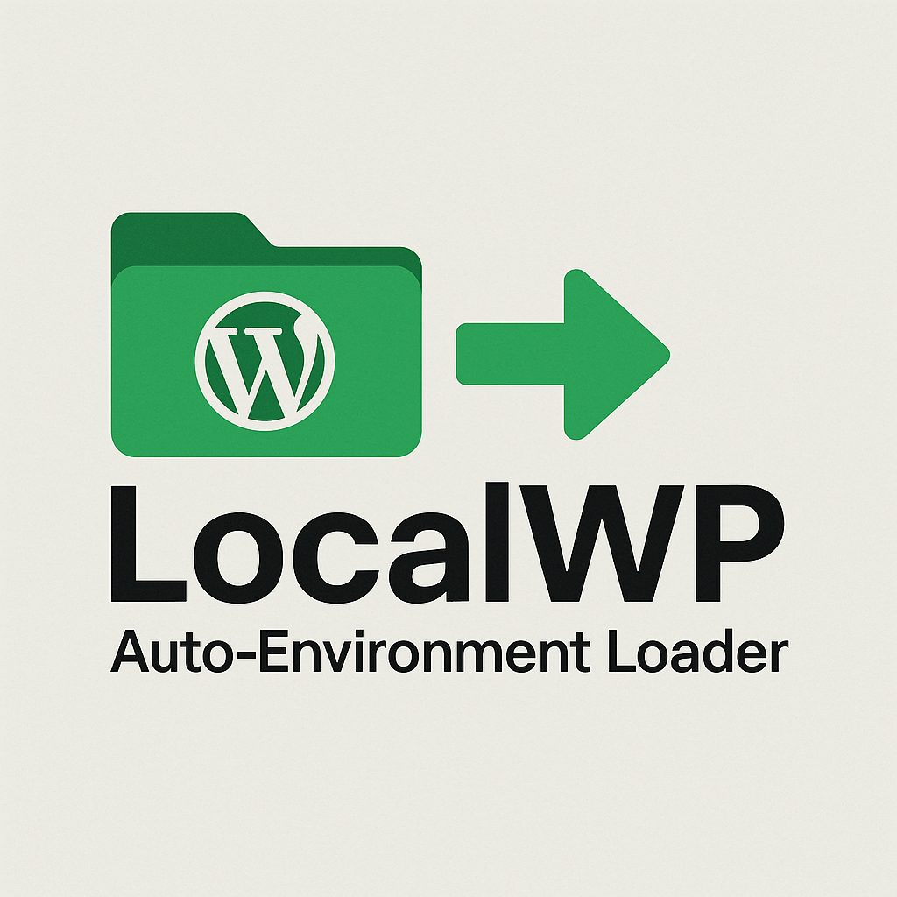
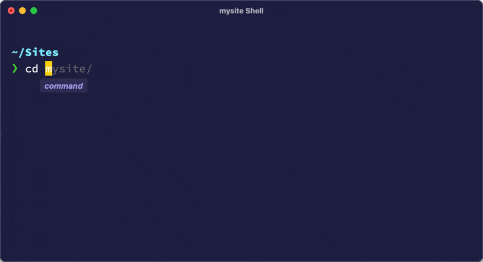

<div align="center">
  
</div>

Stop clicking the 'Site Shell' button in Local.

A shell module that automatically loads Local WordPress development environment settings when you navigate into your Local site directories.

<div align="center">
  
</div>

## Features

- 🚀 **Automatic Environment Loading**: Detects when you enter a Local site directory and loads the appropriate PHP, MySQL, and WP-CLI versions
- 🔄 **Smart Environment Switching**: Automatically clears previous environment when leaving a site directory
- 📊 **Environment Status**: Shows loaded versions of PHP, MySQL, WP-CLI, and Composer
- 🎯 **Zero Configuration**: Works out of the box with Local by Flywheel

## Installation

1. Copy the `.localwp` file to your home directory:
   ```bash
   cp .localwp ~/.localwp
   ```

2. Add this to your `.zshrc` file (customize the username and paths as needed):
   ```bash
   # LocalWP Configuration (customize these paths as needed)
   export LOCALWP_USERNAME="eduwass"
   export LOCALWP_SITES_DIR="/Users/eduwass/Sites"
   export LOCALWP_SSH_ENTRY_DIR="/Users/eduwass/Library/Application Support/Local/ssh-entry"

   # LocalWP: Auto-load Local WordPress environment for any site
   source ~/.localwp
   ```

3. Reload your shell:
   ```bash
   source ~/.zshrc
   ```

## Usage

Once installed, the module works automatically:

1. **Navigate to a Local site**:
   ```bash
   cd ~/Sites/my-wordpress-site
   ```
   
   Output:
   ```
   🚀 Loading Local environment for: my-wordpress-site
   ✅ Local environment loaded for my-wordpress-site (ID: 12345)
      PHP: 8.1.0
      MySQL: 8.0.16
      WP-CLI: 2.7.1
      Composer: 2.4.1
   ```

2. **Leave the site directory**:
   ```bash
   cd ~
   ```
   
   Output:
   ```
   🔄 Clearing Local environment (left my-wordpress-site)
   ```

## How It Works

1. **Directory Detection**: Uses regex pattern matching to detect when you're in a Local site directory
2. **Site ID Resolution**: Searches Local's SSH entry scripts to find the corresponding site ID
3. **Environment Loading**: Parses and executes export statements from Local's environment script
4. **PATH Management**: Intelligently manages PATH to avoid conflicts between different Local environments
5. **Cleanup**: Automatically unsets environment variables when leaving site directories

## Troubleshooting

### Environment Not Loading
- Verify that Local by Flywheel is installed and has created the SSH entry scripts
- Check that your site directory matches the expected pattern
- Ensure the configuration paths are correct for your system

### PATH Issues
- The module automatically cleans Local paths from PATH when switching environments
- If you experience issues, try restarting your shell

### Permission Issues
- Ensure the `.localwp` file is readable: `chmod +r ~/.localwp`
- Check that Local's SSH entry directory is accessible

## Contributing

Feel free to submit issues and enhancement requests! This module is designed to be easily customizable for different Local by Flywheel setups.